# **Buy-Me**

**Buy-me** is an app that helps the user keep track of there regular shopping, with multiple editing choices - quantity, location, deleting an item as well as adding new items and checking if the grocery needs to be bought or not. It's an app designed to work both for the single person as well as being interactive enough to be used for the weekly shopping to a household, club, for event planning etc, without having to always do the shopping together but still being able to easily keep track of what is needed and what is all ready in store. 

Let me introduce you further to [**Buy-Me**](https://but-me-py.herokuapp.com/)!
 
 

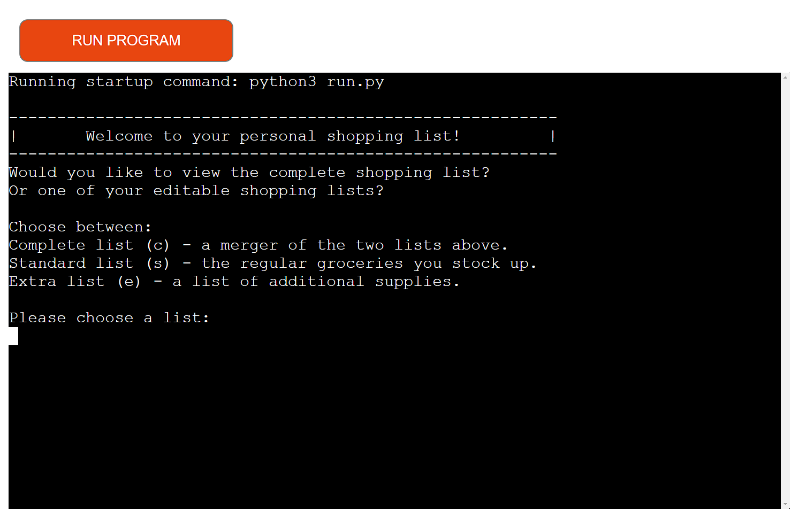
 

## **Content**
1. [**Design**](#design)
    - [Data structure](#data-structure)
    - [Tabel layout](#tabel-layout)
    

2. [**Features**](#features)
    - [Welcome page](#welcome-page)
    - [Complete list](#complete-list)
    - [Standard list](#standard-list)
    - [Extra list](#extra-list)
    - [Actions menu](#actions-menu)
    - [Check item](#check-item)
    - [Change quantity](#change-quantity)
    - [Change location](#change-location)
    - [Add item](#add-item)
    - [Delete item](#delete-item)
    - [Back to main menu](#back-to-main-menu)
   

3. [**Technologies**](#technologies)

4. [**Testing**](#testing)
    
5. [**Deployment**](#deployment)
    - [Deployment](#deployment)
    - [Clone](#clone)
    - [Forking](#forking)

7. [**Credits**](#credits)
    - [Content](#content)
    - [Acknowledgement](#acknowledgement)

[Back to top](#buy-me)

---

## **Design**

## **Data structure**
To get a clear view of what should be included and how the flow of the program should work, I used [LucidChart](https://www.lucidchart.com/pages/) to construct a data model mock up as well as a mock up of the worksheet.

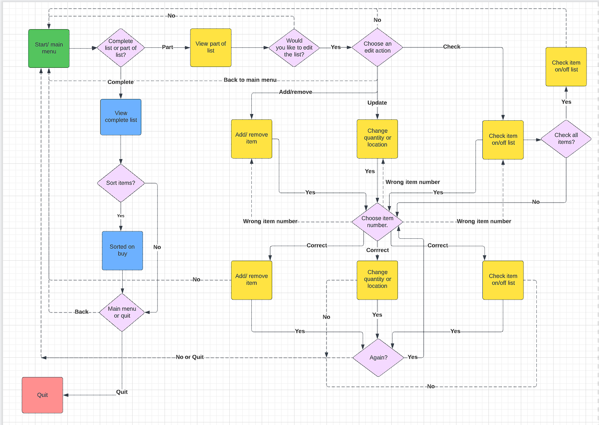 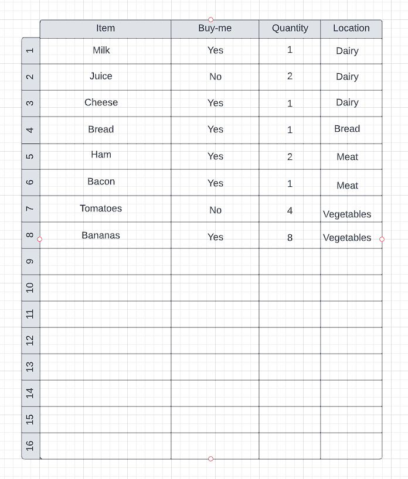 
 

### **Table layout**
Buy-Me is displayed in a python terminal supplied by [**Heroku**](https://www.heroku.com/), giving the app a simple yet straigtforward look. 
To make the lists easy to read and more visual appealing, [**PrettyTable**](https://pypi.org/project/prettytable/) was installed and implemented when the lists are diplayed to the user.

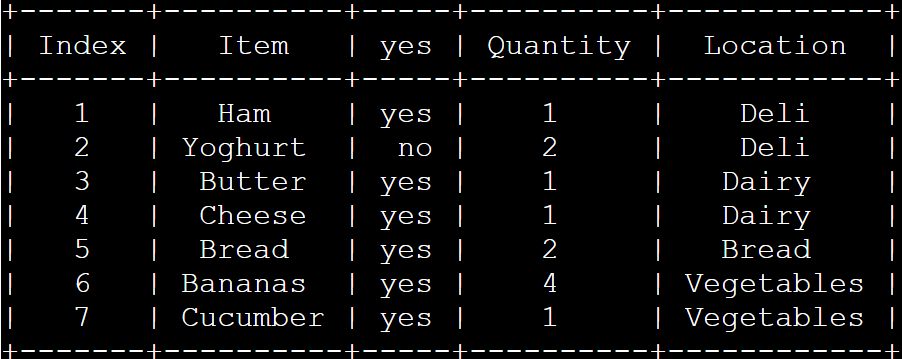

 

[Back to top](#buy-me)

---

## **Features**

### **Welcome page**

After the user runs the application they are greeted with a welcome message that in a few lines describes the app and gives the user the option to choose between three different list settings. Along the way, the user always get the choice to confirm their action or revert their choice.
 
 

 

### **Complete list**

The complete list is a none editable list consisting of the standard list and the extra list merged together so the user has a comprehensive list off all the items in one view. The list can be sorted regarding the location in the store or if the item is checked as 'to buy' or not. After choosing to sort the list or not, the user gets the choice to other quit the app or go back to the main menu a.k.a. the welcome page.
 
 
<strong>The list sorted on location, by default.</strong>
 
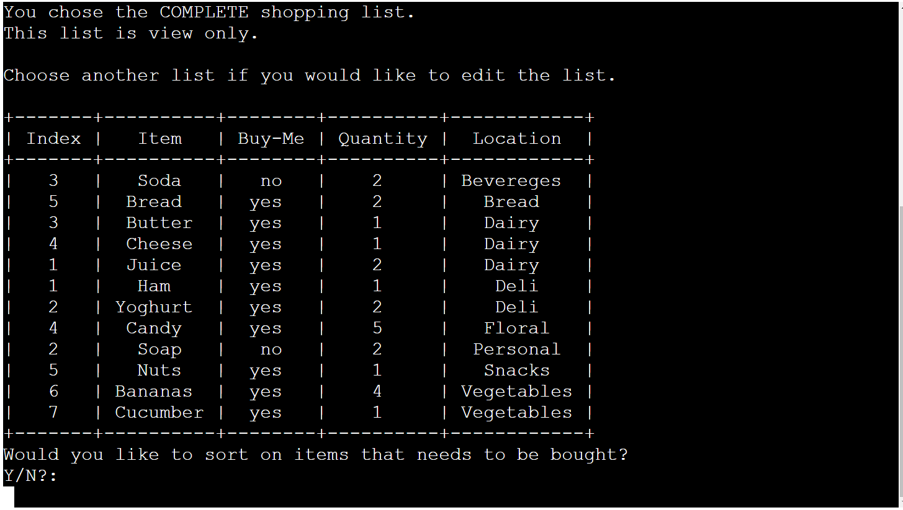 
 
 
<strong>The list sorted by the need to buy or not.</strong>
 
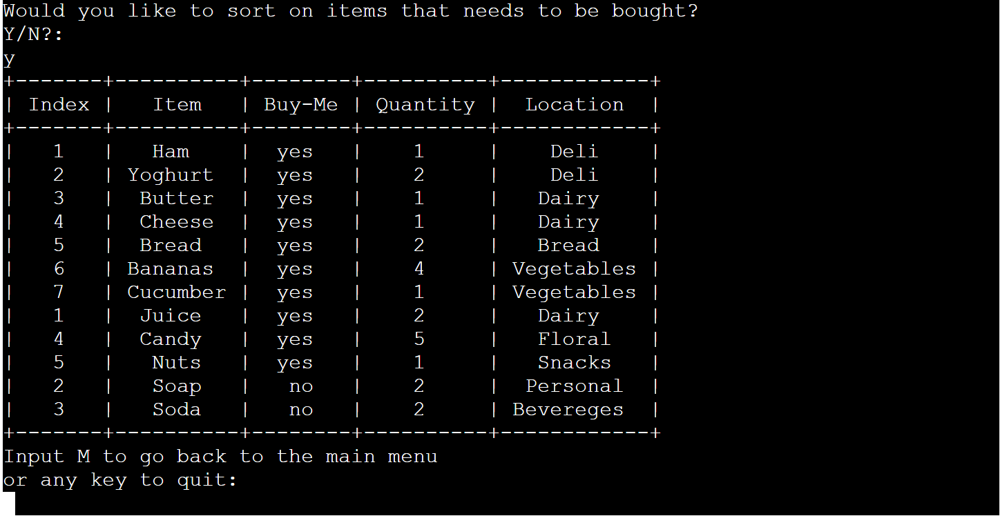
 

### **Standard list**

The second list is the standard list. Set to be the regular list for everyday/ weekly shopping groceries that the user restocks every week. 
 
 
<strong>The list sorted on index number.</strong>
 
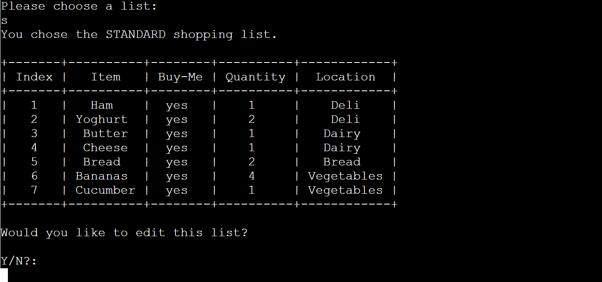 
 

### **Extra list**

The third list is the extra list. The purpose of this list is to fill it with items and groceries the user not need every week, or if there is something special the user likes to buy the next time they go to the store. 
 
 
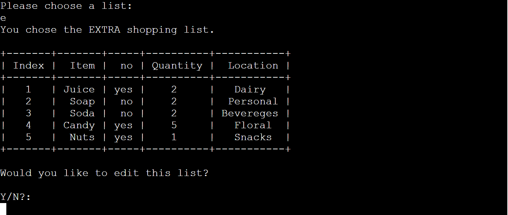
 

### **Action's menu**

After the user have picked either the standard or extra list, they get the option to edit the list or not. If they press no, they go back to the main menu and if they chose to edit the list, they are presented with an action's menu. 
 
 
<strong>Their is 6 actions for the user to pick from.</strong>
 
 
 
 

### **Check item**

The first option on the list is to check the item if it needs to be bought('yes') or if it has been bought already, or is in stock at home ('no'). The user gets the choice to either change the buy status of all the items on the list to either YES or NO or just one item. After the item(s) are checked, the user are displayed the updated list.
 
 
<strong>Check all items.</strong>
 
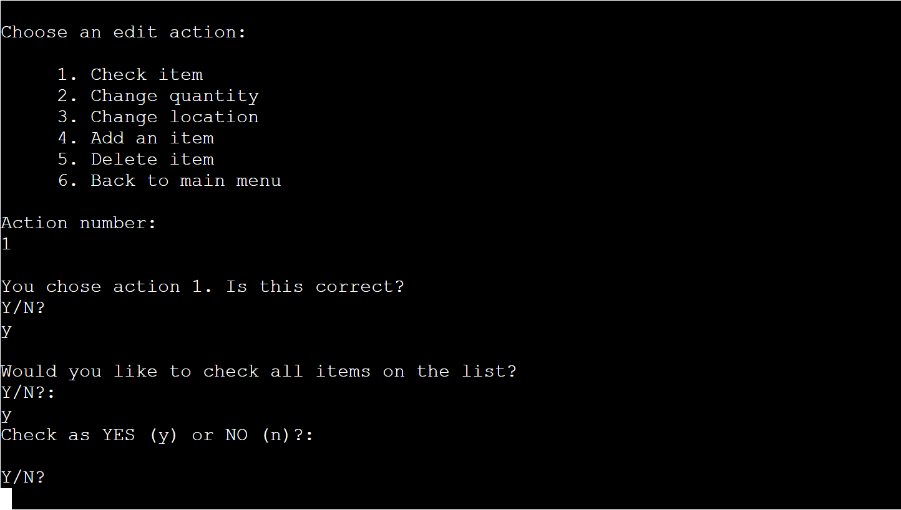 
 
 
<strong>After all items been checked, the user automatically gets transported back to the main menu.</strong>
 
 
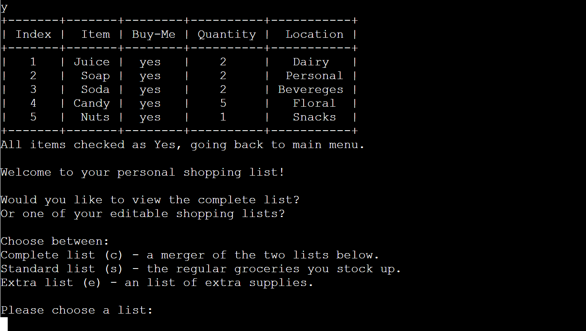
 
 
<strong>Check one item.</strong>
 
 
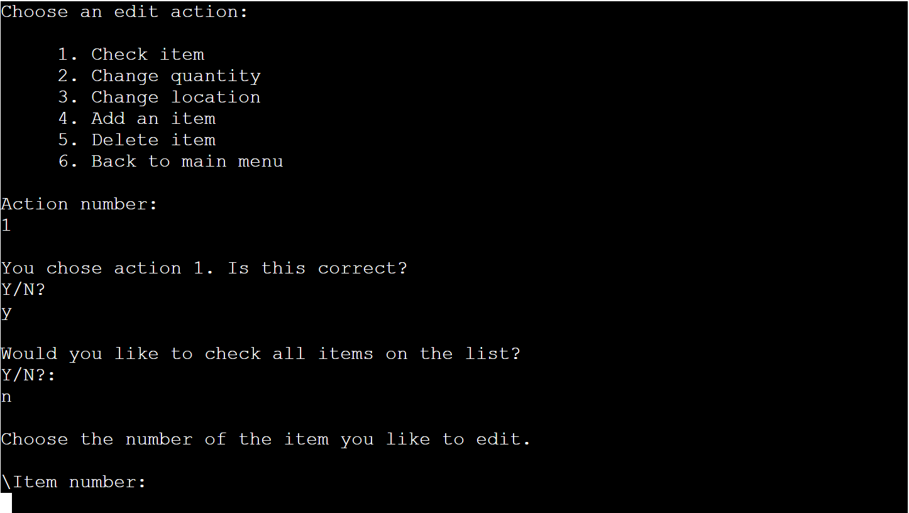
 
 
<strong>After the first item is checked, the user gets the choice to check another item straight away or go back to the main menu.</strong>
 
 
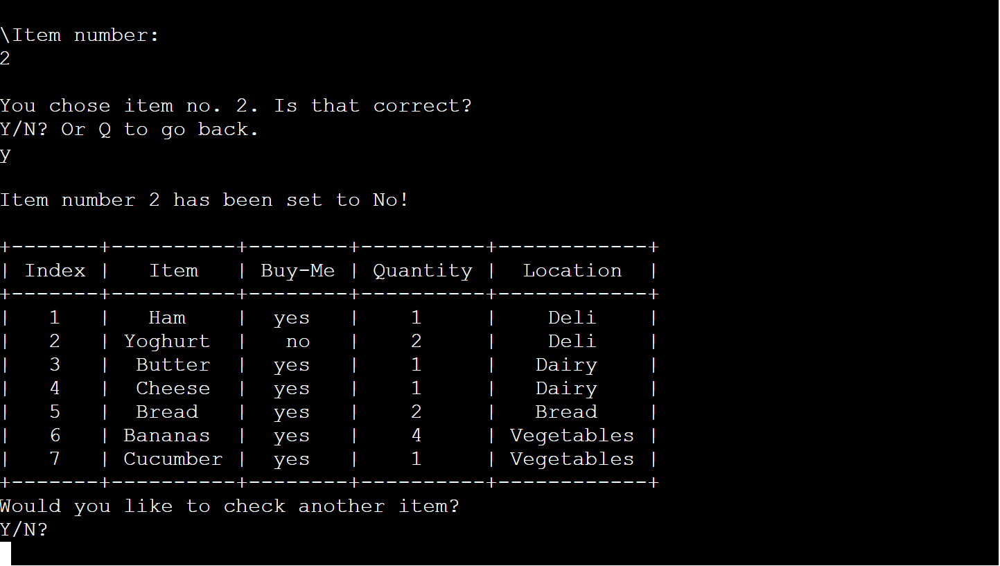
 

### **Change quantity**

The second option on the list is to change the quantity of an item. First the user picks the item they want to update, and then they can input the new quantity number. Before the item is updated, the user has to confirm their action. After the item are edited, the user are displayed the updated list and get's the choice to edit the quantity of another item or go back to the main menu.
 
 
<strong>First the user choose an item.</strong>
 
 
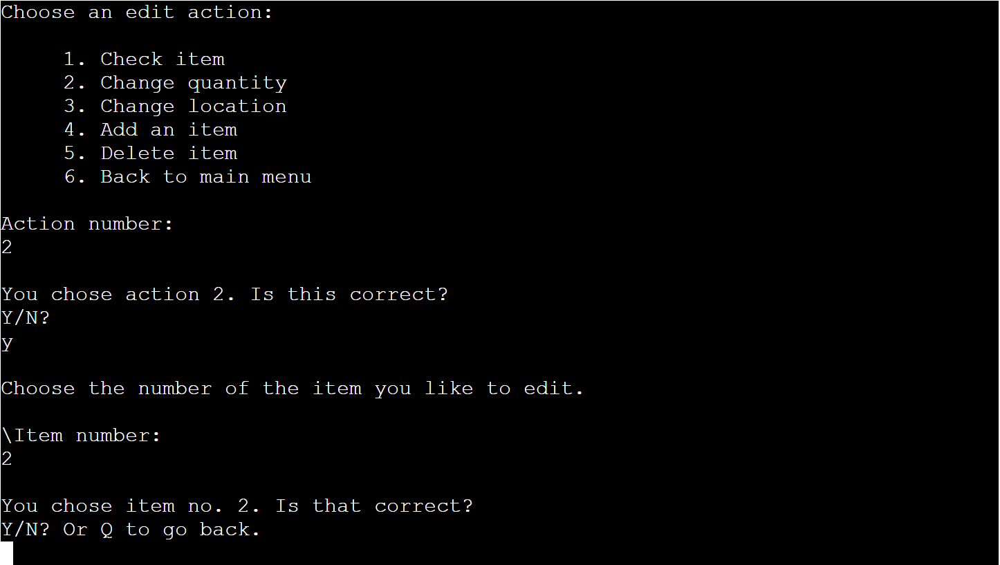
 
 
<strong>Then the uses gets to input the new quantity before confirming the choice.</strong>
 
 
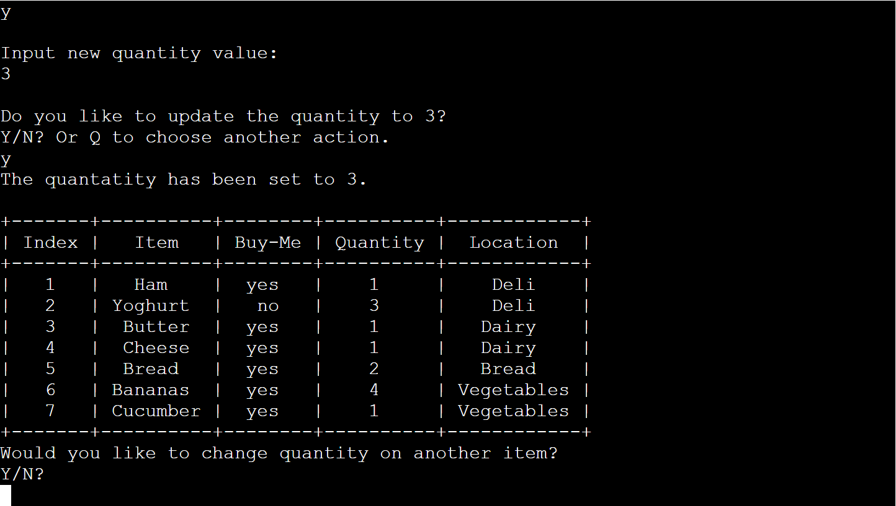
 

### **Change location**

The third option on the list is to change the location of an item. The flow of the actions are similar to the choice of changing the quantity. After the item is edited, the user are displayed the updated list and get's the choice to edit the location of another item or go back to the main menu.
 
 
<strong>First the user choose an item.</strong>
 
 
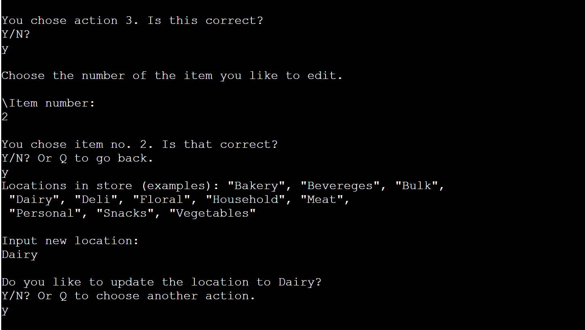
 
 
<strong>Then the uses gets to input the new location before confirming the choice. The user is displayed examples of different locations in the store. </strong>
 
 
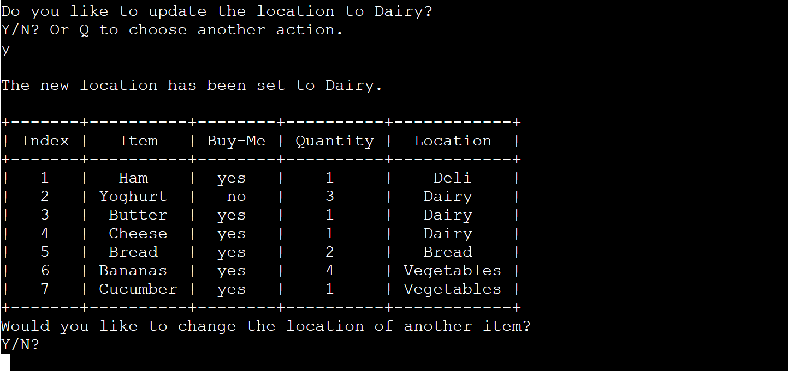
 

### **Add item**

The fourth option on the list is to add a new item. After choosing to add an item and confirming the choice, the user gets three new values to choose before they can update the list; <em>Name</em> of item, <em>quantity</em> and <em>location</em> in the store. The item is automatically set to buy: <em>Yes</em>. After the item is edited, the user are displayed the updated list and gets the choice to add another item or go back to the main menu.
 
 
<strong>The user gets three input fields to fill out.</strong>
 
 
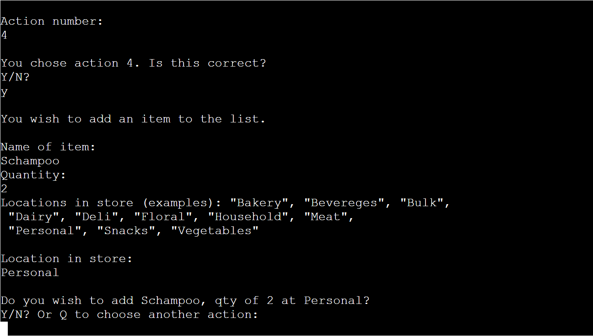
 
 
<strong>After the user confirms the choice to add the input's given, the new updated list is displayed. </strong>
 
 
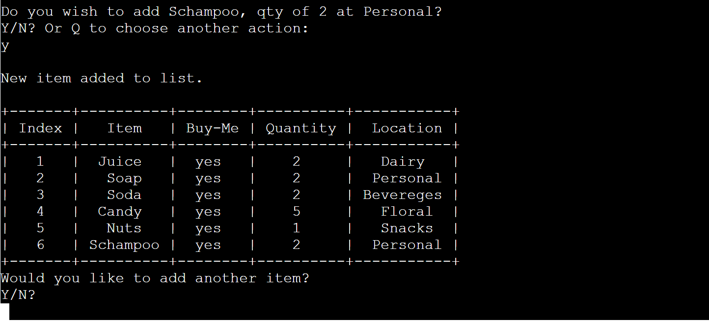
 

### **Delete item**

The fifth edit option on the list is to delete an item. After choosing the item to delete, the user are shown the complete row of content and needs to confirming the choice before it is deleted. The row index is automatically updated after the row is deleted, to display the current order of items. After the item is edited, the user are displayed the updated list and gets the choice to delete another item or go back to the main menu.
 
 
<strong>The user needs to confirm the displayed row as the correct one they want to delete.</strong>
 
 
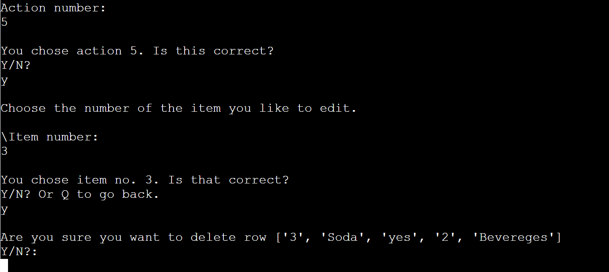
 
 
<strong>After the user confirms the choice to add the input's given, the new updated list is displayed. </strong>
 
 
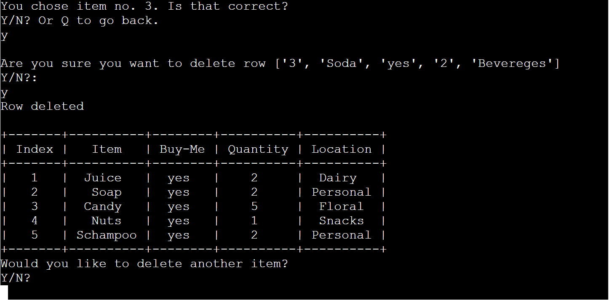
 

### **Back to main menu**

The last and sixth option on the list is not to edit an item but to go back to the main menu. It might be that the user chose the wrong list or that the item they wanted to edit all ready is edited or a number of reasons why the user would like to see another list.
 
 
<strong>The user get's the choice to go back.</strong>
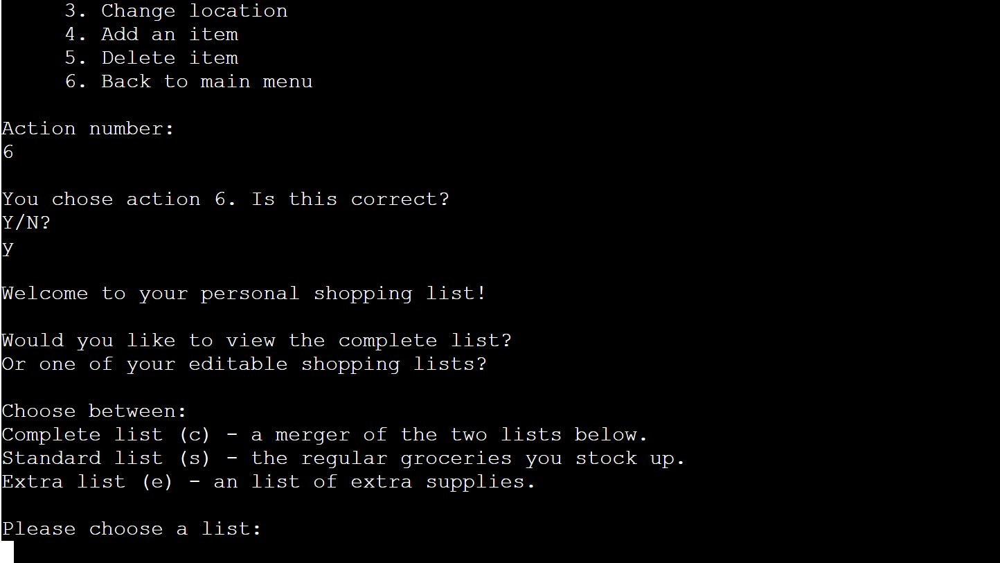
 

### **Future features**
- I would love to add a feature so the user is able to sort the groceries according to the location they appear in their store, making the shopping even easier and with better flow for the user.
- Ideally I would also like to add style to the application to make more aestetically pleasing.

[Back to top](#buy-me)

---

## **Technologies**

### **Languages**

- **Python** 
Is the primary language used to develop the CLI (*command line interface*) application.
 

- **Other languages** 
The template provided by Code Institute for this project also includes HTML, CSS and JavaScript. Though I have not used this languages on my own development in this project, they provide a foundation for my project to be built and deployed correctly.
 

### **Tools**

- [Heroku](https://www.heroku.com/)
    -  I used Heroku to deploy the application.  

- [Lucid Chart](https://www.lucidchart.com/pages/)
    - I used Lucid Chart to design the data model and list mock up for the project.

- [GitPod](https://www.gitpod.io/)
    - I used GitPod as the code editor as well as to display to test out changes in my code.

- [GitHub](https://github.com/)
    - I used GitHub to create a repository for my project.

- [Google-auth](https://google-auth.readthedocs.io/en/master/)
    - I used Google-auth to authenticate the Google API's so the project could be accessed in the cloud.

- [Google cloud platform](https://cloud.google.com/)
    - I used to create the API's that connects the application to the spreadsheet at Google Sheet.

- [Google sheets](https://spreadsheets.google.com)
    - I used for storing data accessed by the application.

- [Gspread](https://docs.gspread.org/en/latest/)
    - Library installed. I used gspread to handle and update the data stored in the spreadsheet at Google Sheet.

- [PEP8](http://pep8online.com/)
    - I used PEP8 online check to test and validate my python code.  

- [PrettyTable](https://pypi.org/project/prettytable/)
    - Library installed. I used PrettyTable to generate the table structure design for better visual of the shopping lists.

[Back to top](#buy-me)

---

## **Testing**

For more information about the testing performed during the development, go to the separate [testing](/TESTING.md) page.
 
 

[Back to top](#buy-me)

---

## **Deployment**

### **Deployment**

The project was deployed to **Heroku** from **GitPod**:
- After creating an account or logging in to an existing one on Heroku, click the "New" button on the right hand side of the 'Personal' menu.
- Choose the option 'Create new app' and then choose a unique name for your application and the right region. Then click 'Create New App'.
- Next you need to add buildpacks and create config vars, this is utterly **important** to have done before you deploy your app!

    - Click 'settings' in the menu under your personal menu.
    - Start with adding the buildpacks, click 'add buildpack'. Add the buildpacks one by one. For this project I used: `heroku/python` &. `heroku/nodejs`
    - Then add config vars by clicking 'Reveal Config Vars'. I used _Config Var_ called `PORT`, set to `8000`.
    - If you have credentials for your project, you need to add these as well. Create another _Config Var_ called `CREDS` and paste the copy of the requeriments code inside your credentials file into the value field.

- Now it's time to deploy the app. Go back to the top of the page and click "Deploy".
- Choose a deployment method, I used GitHub since my repository is located on GitHub.
- Scroll down to 'Connect to GitHub' and search for your project. Make sure you are connected to the right GitHub account. Click 'Connect'.
- Keep scrolling downwards, now you can choose between Automatic Deployment or Manual Deployment. I choose Manual first, until the app was properly deployed and a link to the app was visual. Then I choose to enable automatic deployment for smoother testing. 

The live app can be found here: https://but-me-py.herokuapp.com/ (Yes! I made a type-o choosing the name of the application on Heroku and noticed too late to change it.)
 
The spreadsheet on Google Sheet can be viewed [here](https://docs.google.com/spreadsheets/d/1HNBpKIQLXA24r0K8Fx6FfPgErNIkh0z-kQDbgPGzE_c/edit#gid=1154732416).
 
 

A copy of this GitHub Repository can be made by either making a copy on your local machine or by forking the GitHub content. By using a copy of the repository changes can be made to the copy without affecting the original code. To make a copy of the repository, follow these steps:

### **Clone**
- Locate the repository at **GitHub**.
- At the top of the file's menu, click the green *code* button to the right.
- The first option in the drop-down menu is clone, where you get three choices of how to clone the repository.
- To clone a copy of the python project, click the 'copy' icon on the right-hand side of **Clone with HTTPS**.
- Choose your code editor, open GitBash and change the working directory to where you want the cloned directory to be made saved.
- In the terminal you write git clone and then paste the copied URL. Like this: '$ git clone https://github.com/Monika-81/project3.git' 
- Press enter and then install the dependencies you like to use for the project. To run this project I recommend to atleast install **gspread**.
 

### **Forking**
- Locate the repository at **GitHub**.
- At the top right-hand side is a button called *fork*, click on the button to create a copy of the original repository in your GitHub Account.
 
 

[Back to top](#buy-me)

---

## **Credits**

### **Content**

For most of the development and bug fixes I went back to the Code Institute LMS and the learning material for the python module and the 'Love Sandwiches' project. I also turned to the Slack community and the search function, where I found many tips when I got stuck. When I didn't find the answers to understand what I needed to change there, I consulted external sources while searching for the answer using Google. No piece of code was copied to use in the project, by reading on many different sites I learned more about python and used what I learned to try out was doing wrong.

Some of the sites I frequently **consulted** was :
 

* [CodeGrepper](https://www.codegrepper.com/)
* [DelftStack](https://www.delftstack.com/)
* [Programiz](https://www.programiz.com/)
* [PyPi](https://pypi.org/project/prettytable/)
* [Python](https://www.python.org/)  
* [PythonGuides](https://pythonguides.com/)
* [RealPython](https://realpython.com/)
* [Stack Overflow](https://stackoverflow.com/) 
* [W3School](https://www.w3schools.com/)

 
The template used in the project was provided by Code Institute. The terminal design of the app on Heroku is due to the code supplied in the template.
 
 

### **Acknowledgement**

- My mentor **Precious Ijege** at Code Institute for valuable input and encouragement.
- The Slack community for be such an open, warm and sharing place. 
- **Alfred Skedebäck** for the original idea of an app he developed for private use. I've never seen or used the app he developed but it was the inspiration for this project.
- **Viet Hoang** for letting me run the app by him and for getting user experience input before, during and at the final stage of the project.

[Back to top](#buy-me)

---

