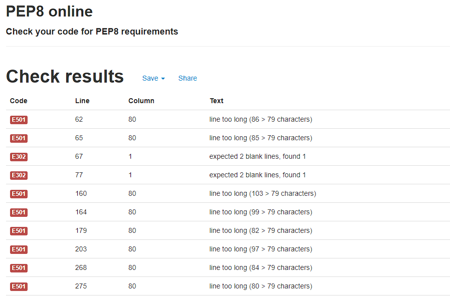
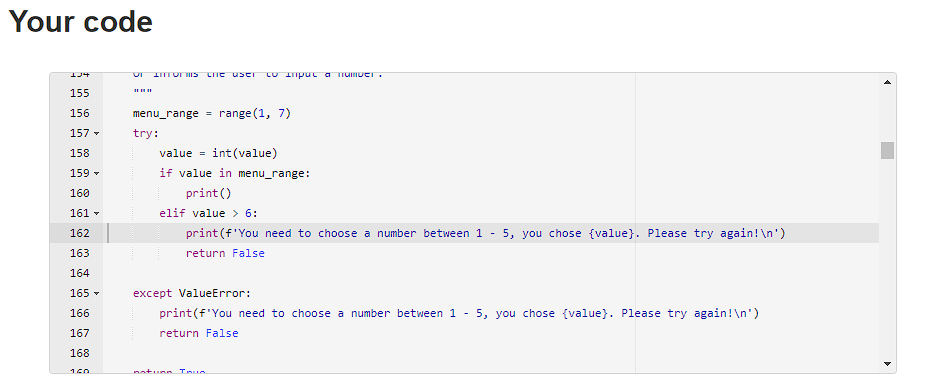
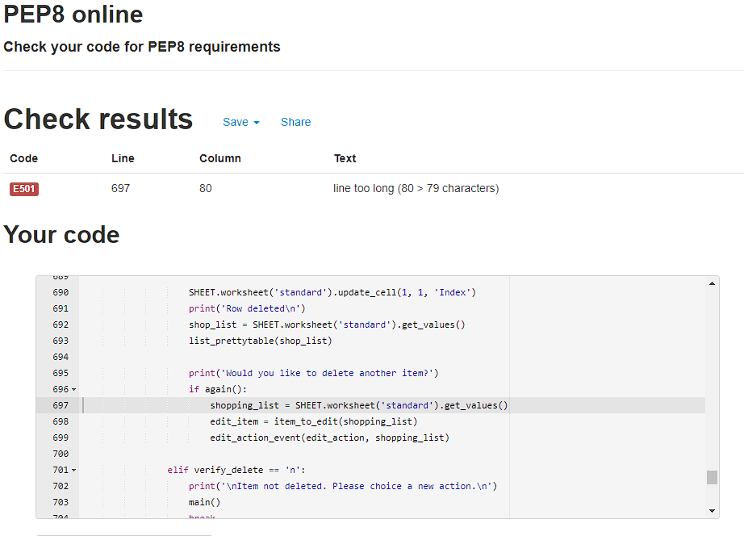

# **Testing**

1. [Manual testing](#manual-testing)
2. [Code validation](#code-validation)
    - Python PEP8
3. [Bugs and fixes](#bugs-and-fixes)

---

### **Manual testing**

During the entire developing stage I repeatedly tested the code added and altered regarding function and apperance via a python3 command terminal in the GitPod code editor. After the site was live deployed I also checked the site regularly trough the Heroku app to see how it behaved. One of the most important functions of the app was to validate the input data so the user cant't proceed without putting in the right value. It took extensive work since there are multiple input fields and multiple actions that requires the user to confirm there choice or make another one but in the end all requested validation works. My best friend in the debugging and testing was to add print-statements along the flow of the code, to see exactly where the bug appered as well as commenting out code and reading the error messages in the terminal. I also had my boyfriend test the deployed app to search for bugs I hadn't noticed.

 

[Back to top](#testing)

---

### **Code validation**
 

- [Python PEP8 Validator](http://pep8online.com/) 

When the basic structure of the project was done I ran code validation through the PEP8 Validator. This procedure was repeated multiple times to validate that the code was working during the developing process. Mostly the PEP8 reported bugs with withespace, both too much withespace as missing whithespace in the code, as well as with my lines beeing too long. In the end testing one error still occured, ln697 contains 80 characters but can not be shorted since the code is nested and indented. See pictures below.
 

 
 
 
**Final result:**
 
 
 

[Back to top](#testing)

---

### **Bugs and fixes**
There where a number of bugs and mishaps committed through the development as I tried to learn the best way to code the website. I freakvently created lociacal errors due to not understanding the flow of the code correctly but as the project came along, and the bugs with it, I started too see and understand more naturally what I had done too cause the bug to happen.

**The major bugs where**:  
1. While loops that looped back to previous chosen actions or items after the user chose to go back to main menu. Or kept looping if the input was wrong.
    - Logical error due to not understanding the flow and not properly breaking the loop when I thought I had.
    - Sometimes I discarded the while loop, thinking the loop was the problem but later had too add it again after figuring out what I was doing wrong.
2. The opposite also happend when I thought the code would loop without using a loop at all.
    - Both issues above was finally figured out by revisiting the LMS, Slack and eventually Googeling external pages when needed (see credits on previous page.)
    - One resone behind the logical errors in my code was the functions in the main() functions that I didn't think about as part of the flow of the code.
3. GitPods help hints suggested i changed the range(len(x)) code in the function that loops through the existing length of the code after deleting a row to enumerate(x) for a better flow of code. I read into the subject and changed the code but it developed into another major bug causing the function not to work when [i] wasn't a strin turned into an integer anymore.
    - Fixed by changing the code back to the original code: range(len(x))
4. It the user changed it's mind about what item number the wanted to edit, the input value of the code changed into a "NoneType" and the code stopped due to SyntaxError. 
    - This time I wasn't using a while loop where I should. With the help of print statements and a nights sleep, I finally saw my mistakes. 
5. When showing the updated list after an action, the old list was shown. 
    - Had to add an seperete new line redefining the variable so right list was showing. Added the functionallity to the variable so it is global. 

 

**Bug not fixed**:
- None that I know of at the moment of admission.
 

[Back to top](#testing)

---